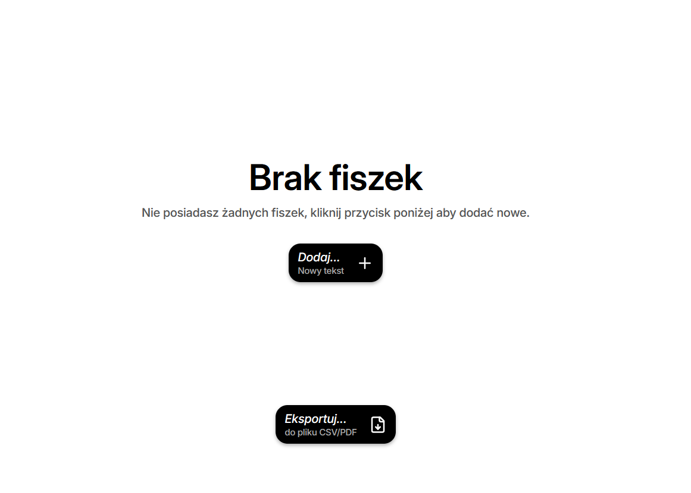
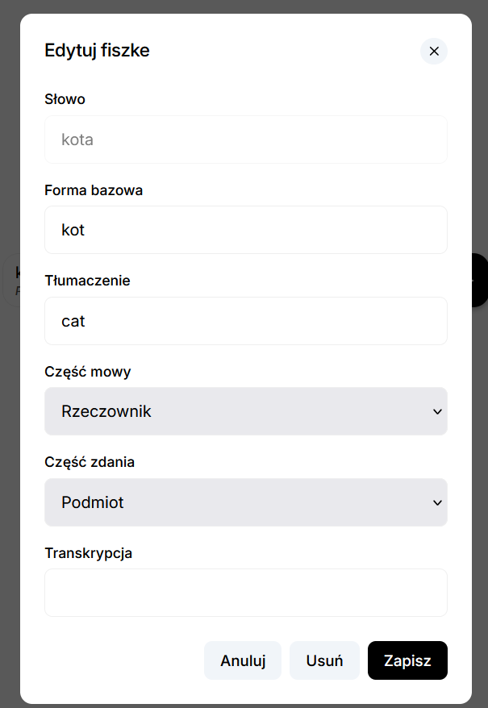
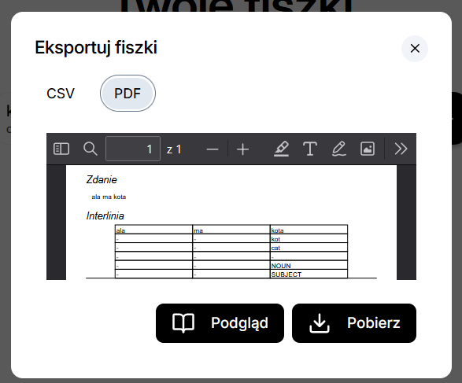
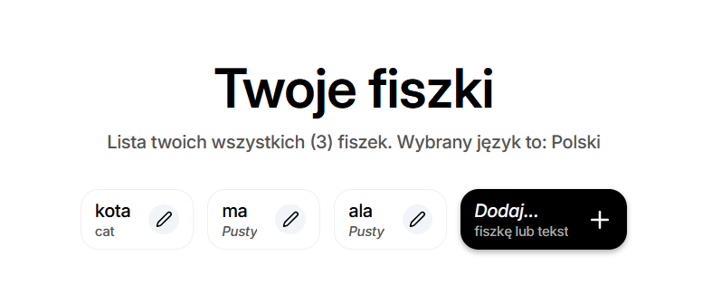

# Fiszki






## Instrukcja Uruchamiania Projektu

Aby uruchomić projekt, wykonaj poniższe kroki:

### Krok 1: Przygotowanie Frontendu

1. Przejdź do katalogu `frontend`.
2. Zainstaluj wymagane zależności za pomocą polecenia `npm install`.
3. Zbuduj aplikację frontendową, wykonując polecenie `npm run build`.

### Krok 2: Uruchomienie Backend

1. Przejdź do katalogu backendowego i uruchom aplikację.
2. Uruchom plik `LangApplication` znajdujący się w katalogu `backend/src/main/java/pl/agh/to/lang/LangApplication`.
3. Aby uruchomić aplikację bezpośrednio z terminala należy wpisać uruchomić polecenie ```./gradlew bootRun```
   

### Krok 3: Dostęp do Aplikacji

1. Po poprawnym uruchomieniu backendu, przejdź do przeglądarki i otwórz stronę `http://localhost:8080`.
2. Aplikacja powinna być dostępna i gotowa do użycia.

## Uwagi

- Upewnij się, że masz zainstalowane:
    - Node.js w wersji zgodnej z pliku `package.json`.
    - Java w wersji 17 lub nowszej.